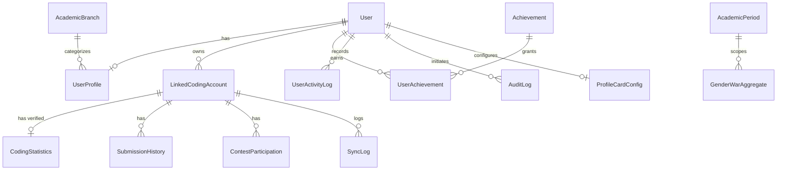

# Relational Data Model & Database Schema

**Project**: College Coding Platform  
**Database**: PostgreSQL 15+  
**ORM**: Prisma ORM

---

## Entity Relationship Overview



---

## Prisma Schema Definition

```prisma
datasource db {
  provider = "postgresql"
  url      = env("DATABASE_URL")
}

generator client {
  provider = "prisma-client-js"
}

enum Role {
  STUDENT
  PLATFORM_ADMIN
  SUPER_ADMIN
}

enum Gender {
  MALE
  FEMALE
}

enum AccountStatus {
  ACTIVE
  DISABLED
  PENDING_VERIFICATION
}

enum PlatformType {
  LEETCODE
  CODEFORCES
  HACKERRANK
}

enum SyncStatus {
  SUCCESS
  FAILED
  IN_PROGRESS
  STALE
}

enum AchievementCategory {
  PROBLEM_SOLVING
  DIFFICULTY_MASTERY
  CONTEST_PROWESS
  CONSISTENCY_STREAKS
  SPECIAL_MILESTONES
}

enum AchievementStatus {
  DRAFT
  PUBLISHED
  ARCHIVED
}

// -----------------------------------------------------------------------------
// 1. Identity & Profile Layer (R1)
// -----------------------------------------------------------------------------

model User {
  id            String         @id @default(uuid())
  email         String         @unique
  passwordHash  String?
  role          Role           @default(STUDENT)
  status        AccountStatus  @default(ACTIVE)
  emailVerified DateTime?
  
  profile       UserProfile?
  cardConfig    ProfileCardConfig?
  linkedAccounts LinkedCodingAccount[]
  achievements  UserAchievement[]
  activities    UserActivityLog[]
  auditLogs     AuditLog[]     @relation("AdminAuditActions")
  
  createdAt     DateTime       @default(now())
  updatedAt     DateTime       @updatedAt

  @@index([email])
  @@index([status])
  @@index([role])
}

model UserProfile {
  id             String          @id @default(uuid())
  userId         String          @unique
  user           User            @relation(fields: [userId], references: [id], onDelete: Cascade)
  
  displayName    String          // Full student name
  gender         Gender          // Male | Female (Strictly explicit, never inferred)
  admissionYear  Int?            // Optional
  graduationYear Int?            // Optional
  branchId       String?         // Optional
  branch         AcademicBranch? @relation(fields: [branchId], references: [id], onDelete: SetNull)
  avatarUrl      String?
  bio            String?         @db.VarChar(300)
  
  // Precomputed ranking cache (updated by batch ranking jobs)
  collegeRank    Int?
  weightedScore  Float?          @default(0.0)
  
  createdAt      DateTime        @default(now())
  updatedAt      DateTime        @updatedAt

  @@index([gender])
  @@index([branchId])
  @@index([collegeRank])
  @@index([weightedScore(sort: Desc)])
}

model AcademicBranch {
  id           String        @id @default(uuid())
  name         String        @unique // e.g. "Computer Science & Engineering"
  code         String        @unique // e.g. "CSE"
  isActive     Boolean       @default(true)
  displayOrder Int           @default(0)
  
  profiles     UserProfile[]
  createdAt    DateTime      @default(now())
  updatedAt    DateTime      @updatedAt

  @@index([isActive])
}

// -----------------------------------------------------------------------------
// 2. External Coding Integration & Sync Layer (R2)
// -----------------------------------------------------------------------------

model LinkedCodingAccount {
  id            String              @id @default(uuid())
  userId        String
  user          User                @relation(fields: [userId], references: [id], onDelete: Cascade)
  
  platform      PlatformType        @default(LEETCODE)
  username      String              // e.g. LeetCode handle
  isVerified    Boolean             @default(false)
  syncStatus    SyncStatus          @default(IN_PROGRESS)
  lastSyncAt    DateTime?
  lastSyncError String?
  
  statistics    CodingStatistics?
  submissions   SubmissionHistory[]
  contests      ContestParticipation[]
  syncLogs      SyncLog[]

  createdAt     DateTime            @default(now())
  updatedAt     DateTime            @updatedAt

  @@unique([platform, username]) // Prevents duplicate claims across active users
  @@index([userId])
  @@index([platform, syncStatus])
  @@index([lastSyncAt])
}

model CodingStatistics {
  id                  String              @id @default(uuid())
  accountId           String              @unique
  account             LinkedCodingAccount @relation(fields: [accountId], references: [id], onDelete: Cascade)
  
  totalSolved         Int                 @default(0)
  easySolved          Int                 @default(0)
  mediumSolved        Int                 @default(0)
  hardSolved          Int                 @default(0)
  
  contestRating       Float?              // Nullable if student is unrated
  globalContestRank   Int?
  contestTopPercentage Float?
  contestsAttended    Int                 @default(0)
  
  currentStreakDays   Int                 @default(0)
  longestStreakDays   Int                 @default(0)
  
  rawSnapshotJson     Json?               // Full raw payload for auditing/debugging
  
  updatedAt           DateTime            @updatedAt

  @@index([totalSolved(sort: Desc)])
  @@index([hardSolved(sort: Desc)])
  @@index([contestRating(sort: Desc)])
  @@index([currentStreakDays(sort: Desc)])
}

model SubmissionHistory {
  id            String              @id @default(uuid())
  accountId     String
  account       LinkedCodingAccount @relation(fields: [accountId], references: [id], onDelete: Cascade)
  
  problemSlug   String
  problemTitle  String
  difficulty    String              // "Easy" | "Medium" | "Hard"
  status        String              // "Accepted" (only accepted stored for metrics)
  submittedAt   DateTime
  
  createdAt     DateTime            @default(now())

  @@unique([accountId, problemSlug, submittedAt])
  @@index([accountId, submittedAt])
  @@index([submittedAt])
}

model ContestParticipation {
  id            String              @id @default(uuid())
  accountId     String
  account       LinkedCodingAccount @relation(fields: [accountId], references: [id], onDelete: Cascade)
  
  contestTitle  String
  rating        Float
  ranking       Int
  problemsSolved Int
  attendedAt    DateTime

  createdAt     DateTime            @default(now())

  @@unique([accountId, contestTitle])
  @@index([accountId, attendedAt])
}

model SyncLog {
  id            String              @id @default(uuid())
  accountId     String
  account       LinkedCodingAccount @relation(fields: [accountId], references: [id], onDelete: Cascade)
  
  triggerType   String              // "SCHEDULED" | "MANUAL" | "ONBOARDING"
  status        SyncStatus
  durationMs    Int
  errorMessage  String?
  timestamp     DateTime            @default(now())

  @@index([accountId, timestamp])
  @@index([status, timestamp])
}

// -----------------------------------------------------------------------------
// 3. Gamification & Configurable Achievements Layer (R4, R7)
// -----------------------------------------------------------------------------

model Achievement {
  id                  String              @id @default(uuid())
  name                String              @unique
  slug                String              @unique
  description         String
  category            AchievementCategory
  iconKey             String              // SVG identifier or URL
  conditionExpression String              // e.g. "total_solved >= 100 AND hard_solved >= 10"
  rarityLevel         String              // "COMMON" | "RARE" | "EPIC" | "LEGENDARY"
  points              Int                 @default(10)
  status              AchievementStatus   @default(PUBLISHED)
  
  recipients          UserAchievement[]
  
  createdAt           DateTime            @default(now())
  updatedAt           DateTime            @updatedAt

  @@index([category, status])
}

model UserAchievement {
  id            String        @id @default(uuid())
  userId        String
  user          User          @relation(fields: [userId], references: [id], onDelete: Cascade)
  achievementId String
  achievement   Achievement   @relation(fields: [achievementId], references: [id], onDelete: Cascade)
  
  unlockedAt    DateTime      @default(now())
  isFeatured    Boolean       @default(false)

  @@unique([userId, achievementId])
  @@index([userId, isFeatured])
  @@index([achievementId, unlockedAt])
}

// -----------------------------------------------------------------------------
// 4. Gender War & Periodic Aggregation Layer (R5)
// -----------------------------------------------------------------------------

model AcademicPeriod {
  id            String                @id @default(uuid())
  name          String                // e.g. "Fall 2026", "2026-2027"
  periodType    String                // "SEMESTER" | "ACADEMIC_YEAR"
  startDate     DateTime
  endDate       DateTime
  isCurrent     Boolean               @default(false)
  
  genderAggs    GenderWarAggregate[]

  createdAt     DateTime              @default(now())
  updatedAt     DateTime              @updatedAt

  @@index([isCurrent, periodType])
}

model GenderWarAggregate {
  id                      String          @id @default(uuid())
  gender                  Gender
  timeWindow              String          // "CURRENT_WEEK" | "CURRENT_MONTH" | "SEMESTER" | "YEAR" | "ALL_TIME"
  periodId                String?
  period                  AcademicPeriod? @relation(fields: [periodId], references: [id], onDelete: SetNull)
  
  participantCount        Int             @default(0)
  totalSolved             Int             @default(0)
  avgSolvedPerStudent     Float           @default(0.0)
  
  totalHard               Int             @default(0)
  avgHardPerStudent       Float           @default(0.0)
  totalMedium             Int             @default(0)
  avgMediumPerStudent     Float           @default(0.0)
  totalEasy               Int             @default(0)
  avgEasyPerStudent       Float           @default(0.0)
  
  ratedParticipantCount   Int             @default(0)
  avgContestRating        Float?
  totalContestsAttended   Int             @default(0)
  avgContestsPerStudent   Float           @default(0.0)
  
  activeCodersCount       Int             @default(0)
  recentSubmissionsCount  Int             @default(0)
  avgStreakDays           Float           @default(0.0)
  
  computedAt              DateTime        @default(now())

  @@unique([gender, timeWindow, periodId])
  @@index([timeWindow, computedAt])
}

// -----------------------------------------------------------------------------
// 5. Public Developer Profile Card Layer (R6)
// -----------------------------------------------------------------------------

model ProfileCardConfig {
  id                  String        @id @default(uuid())
  userId              String        @unique
  user                User          @relation(fields: [userId], references: [id], onDelete: Cascade)
  
  cardToken           String        @unique @default(uuid())
  theme               String        @default("github-dark")
  layout              String        @default("standard") // "standard" | "compact"
  
  showStreak          Boolean       @default(true)
  showRating          Boolean       @default(true)
  showAchievements    Boolean       @default(true)
  featuredBadgeIds    String[]      // Up to 3 achievement IDs
  
  createdAt           DateTime      @default(now())
  updatedAt           DateTime      @updatedAt

  @@index([cardToken])
}

// -----------------------------------------------------------------------------
// 6. Audit & Platform Governance Layer (R7)
// -----------------------------------------------------------------------------

model AuditLog {
  id              String        @id @default(uuid())
  adminUserId     String
  adminUser       User          @relation("AdminAuditActions", fields: [adminUserId], references: [id], onDelete: Restrict)
  
  actionType      String        // e.g. "USER_DISABLE", "ACHIEVEMENT_CREATE", "BATCH_SYNC"
  targetType      String        // "USER", "ACHIEVEMENT", "BRANCH", "CALENDAR"
  targetId        String
  beforeState     Json?
  afterState      Json?
  ipAddress       String?
  userAgent       String?
  
  createdAt       DateTime      @default(now())

  @@index([adminUserId, createdAt])
  @@index([actionType, createdAt])
  @@index([targetType, targetId])
}

model UserActivityLog {
  id              String        @id @default(uuid())
  userId          String
  user            User          @relation(fields: [userId], references: [id], onDelete: Cascade)
  
  activityDate    DateTime      @db.Date
  submissionsCount Int          @default(0)

  @@unique([userId, activityDate])
  @@index([userId, activityDate])
}
```
